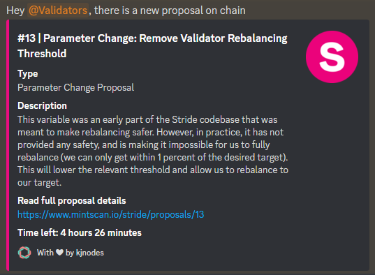

# Discord Proposal Bot

## Intro

As a contribution to all Cosmos ecosystem our team has built this bot to keep chain governance participants notified when there is a new proposal on chain.

## How it works

Bot checks the proposals on chain every minute using our RPC node, if new proposal is found - bot post it in a Discord using a Webhook.

<figure><figcaption>
Proposal example
</figcaption></figure>

## How to use

If you are interested and want us to implement bot into your Discord server please reach out at [admin@kjnodes.com](mailto:admin@kjnodes.com)


As we fully manage current service our bot support chains where we operate our own RPC endpoints.


From kjnodes with :heart:
