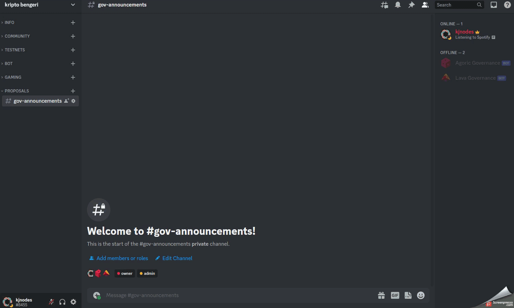
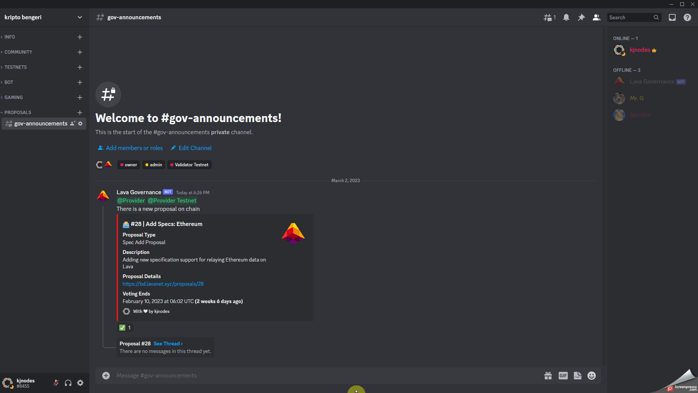

# Discord Proposal Bot

## Intro

As a contribution to Cosmos ecosystem our team has built this bot to keep chain governance participants notified when there is a new proposal on chain.

## How it works

Bot checks the proposals on chain every minute using our RPC node, if new proposal is found - bot post it in a Discord using a Webhook.

### Workflows

Our bot supports three workflows giving the projects oportunity to choose workflow they like the most.

1. **Simple proposal notifications** - this workflow is very simple. Bot connects to dedicated channel using WebHook. Proposal cards are being sent to dedicated channel notifying the relevant user groups. 

<figure><figcaption>
Simple Proposals example
</figcaption></figure>

2. **Proposal notifications with threads** - more advanced worflow where bot is invited to the server with set of permissions. This workflow is similar to first one, but it also adds reactions ✅  and 🧵 threads to the posts where validators can do discussions.

<figure><figcaption>
Threaded Proposals example
</figcaption></figure>

3. **Forum proposals** - more advanced worflow where bot is invited to the server with set of permissions. Bot creates forum posts with proposal cards and sends out notification in announcement channel (this feature can be enabled/disabled based on client needs) This workflow is very similar to governance solution used in [Osmosis Discord Server](https://discord.gg/osmosis).

<figure><figcaption>
Forum Proposals example
</figcaption></figure>

## How to use

If you are interested and want us to implement bot into your Discord server please reach out at [admin@kjnodes.com](mailto:admin@kjnodes.com)


As we fully manage current service our bot support chains where we operate our own RPC endpoints.


From kjnodes with :heart:
