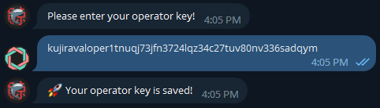
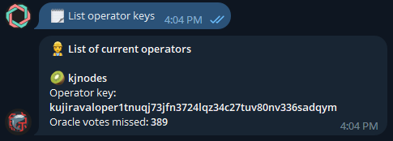
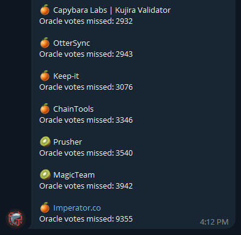

# Kujira Oracle Monitoring Bot

## Intro

Kjnodes team have created this bot for the  Kujira community to keep validators notified when there is change in Oracle Price Feeder status. When the validator starts to miss Oracle Votes bot will send notification message.

[🤖 Kujira Oracle Monitoring bot | kjnodes](https://t.me/kjnodes\_oracle\_bot)

## How to use

To start using the bot type `/start` command and choose one of the commands:

* :construction\_worker: **Add an operator key** - type in your **valoper** __ address of your validator to add it to the bot.

<figure><figcaption>
Add an operator
</figcaption></figure>

* ⭕️ **Reset operator keys** - this will reset all your saved validator entries.
* 📃 **List operator keys** - will list your saved validator entries

<figure><figcaption>
List of saved operators
</figcaption></figure>

* 📃 **List all operators** - will list all oracle operators sorted by missed oracle votes in current cycle

<figure><figcaption></figcaption></figure>


To reduce spam alerts with each status change, you will be notified only if your validator exceeds threshold that is set to: **16** missed oracle votes per **10** minutes (That's about **86%** fail ratio)


That's it! You are all set! Here is some example of the notification from the bot.

<figure><figcaption></figcaption></figure>

From kjnodes with :heart:
