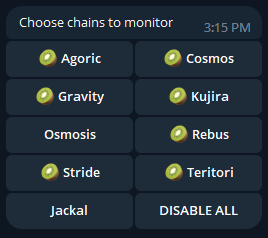

# Telegram Proposal Bot

## Intro

Kjnodes team have built bots to keep validators notified when there is a new proposal on the chain. To distinguish mainnet from testnet we have created two separate bots that can be found by following links provided below.

[🤖 Mainnet Proposal Bot](https://t.me/kjnodes\_proposal\_bot) | **Supported chains**: 17 | **Users**: 140 | **Active subscriptions**: 226

[🤖 Testnet Proposal bot](https://t.me/kjnodes\_testnet\_proposal\_bot) | **Supported chains**: 27 | **Users**: 421 | **Active subscriptions**: 1331

## How to use

To start using the bot type `/start` command and choose the networks in which you want to get notified. 🥝 icon will tell you which network notifications are turned on.

<figure><figcaption>
Bot menu
</figcaption></figure>


Currently bots support chains where we operate our own RPC endpoints. List of supported chains can be found in the bot menu.


That's it! You are all set! Here is some example of the notification from the bot.

<figure><figcaption>
Bot notification message
</figcaption></figure>

From kjnodes with :heart:
